## How does IAM work?
- ### `Authentication`
	- ### Are you who you say you are?
- ### `Authorization`
	- ### What actions do you have permission to perform?
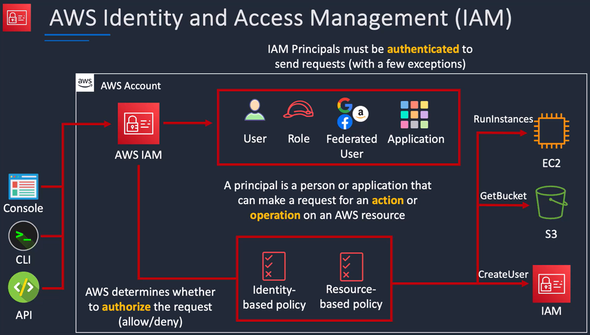

(in more detail for a `User`)

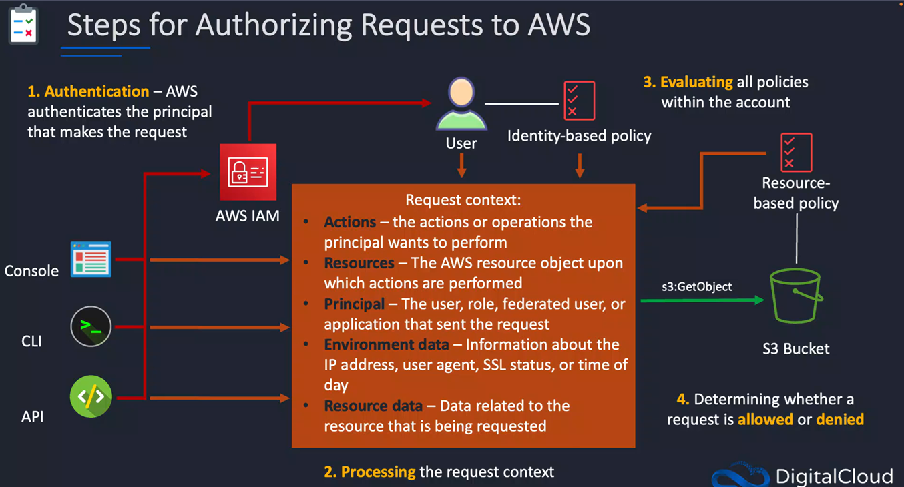

## Users, User Groups, Roles, Policies
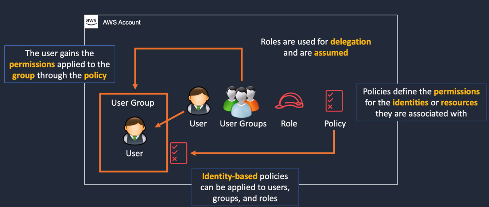

- ### For every resource in AWS, it has an `Amazon Resource Name (ARN)`
	- ### A unique identifier
	- ### E.g. Highlighted in red below is the user account number, the whole thing is the `ARN`
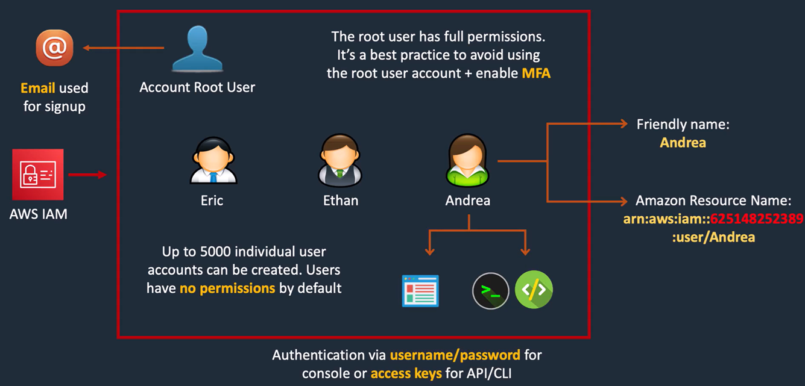

## Authentication methods
- ### AWS Management Console
- ### API/CLI
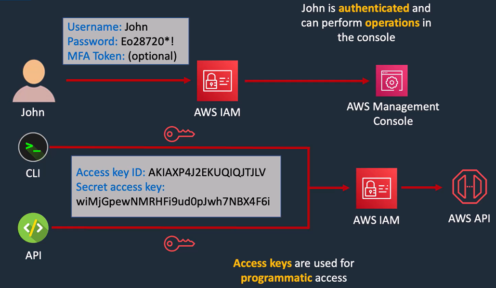

- ### Root user vs IAM user
	- ### IAM users have 0 permissions by default and can only update their password
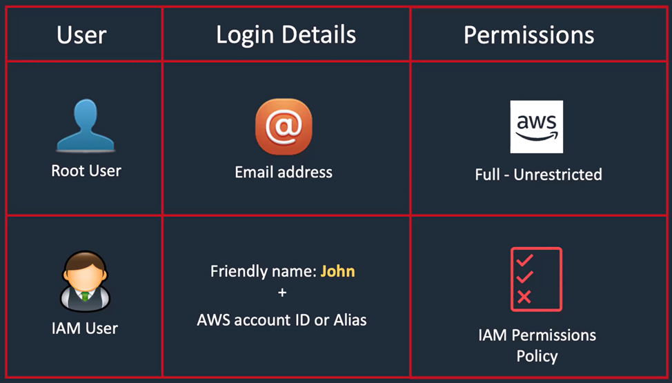

## Multi Factor Authentication (MFA)
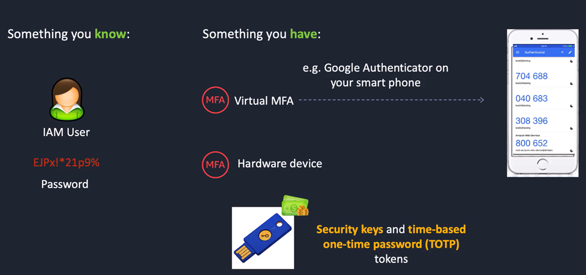

## Permissions Boundaries
- ### Has precedence over other permission policies
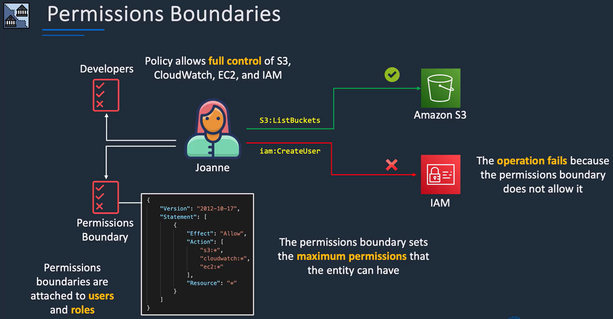

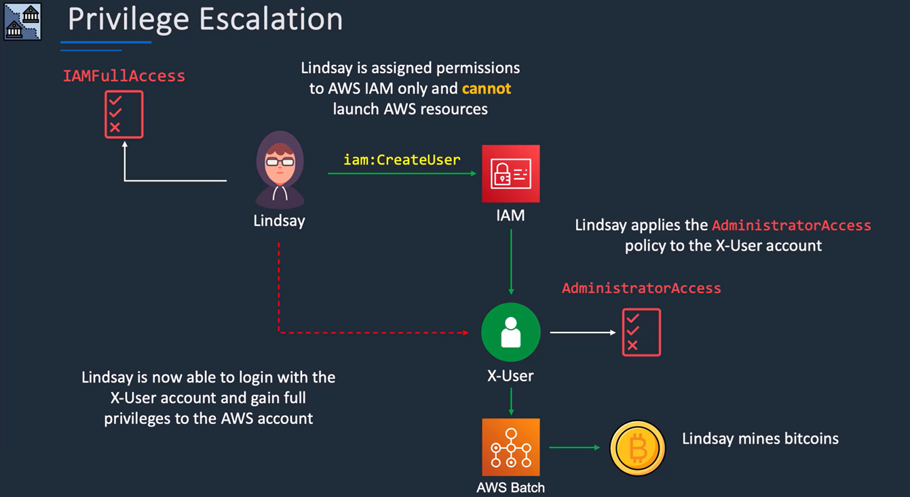

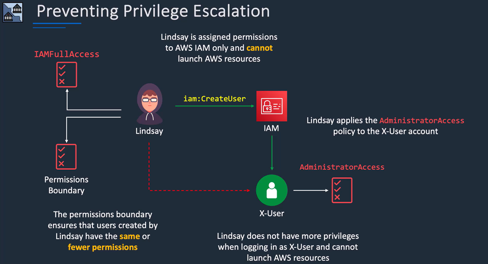

## Types of policies
- ### Indentity
- ### Resource
- ### Permission boundaries
- ### Service Control (SCP)
- ### Session
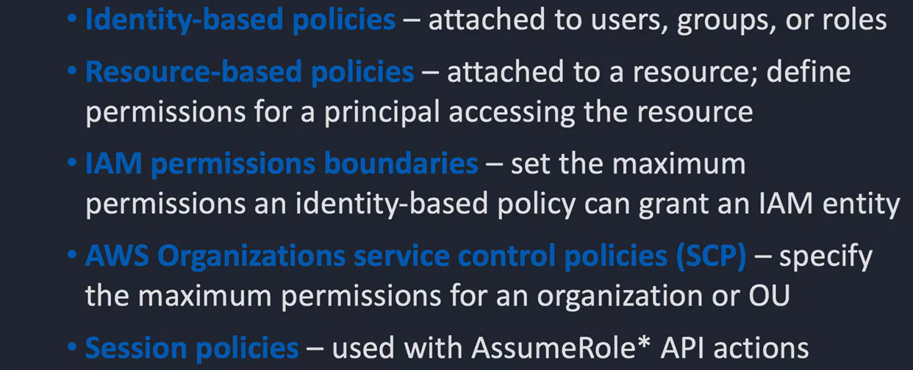

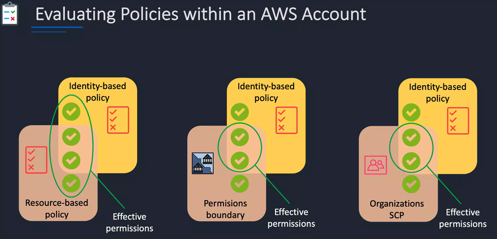

- ### Use the [IAM Policy Simulator](https://aws.amazon.com/about-aws/whats-new/2026/07/iam-policy-simulator-iam-console/) to see what permissions a user actually has

## IAM Policy Structure
- ### Each AWS service has a set of actions you can perform
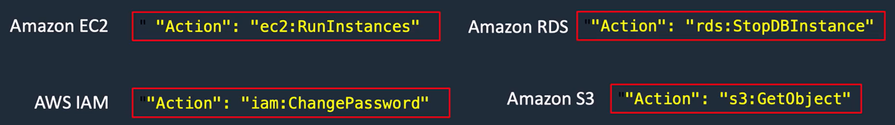

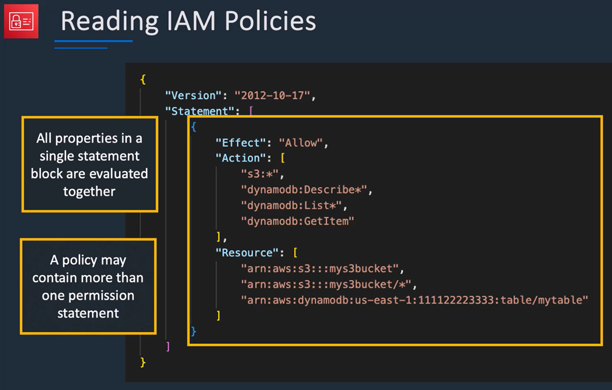

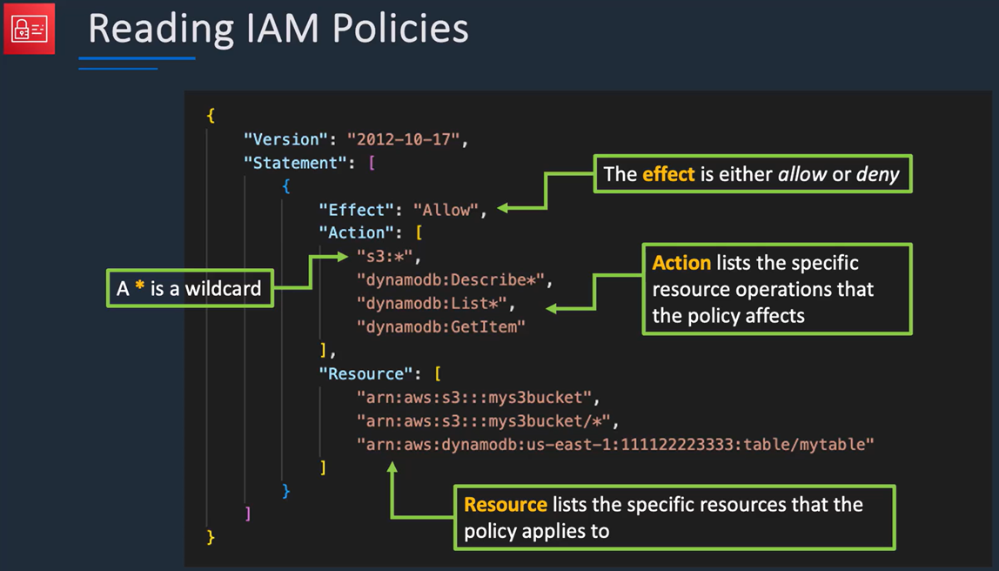

## IAM Best Practices
- ### Require human users and workloads to use temporary credentials with IAM roles to access AWS
	- ### Workloads are resources or code that delivers business value, such as an application or backend process

- ### Require multi-factor authentication (MFA)

- ### Update access keys when needed for use cases that require long-term credentials

- ### Apply least-privilege permissions

- ### Regularly review and remove unused users, roles, permissions, policies, and credentials