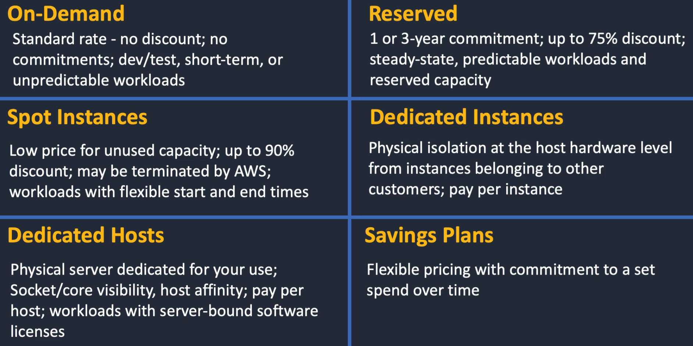
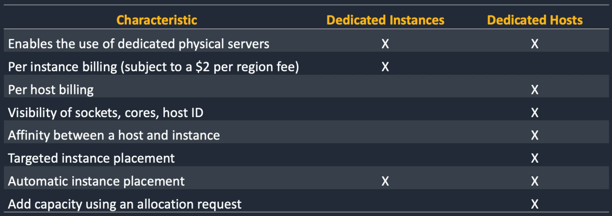
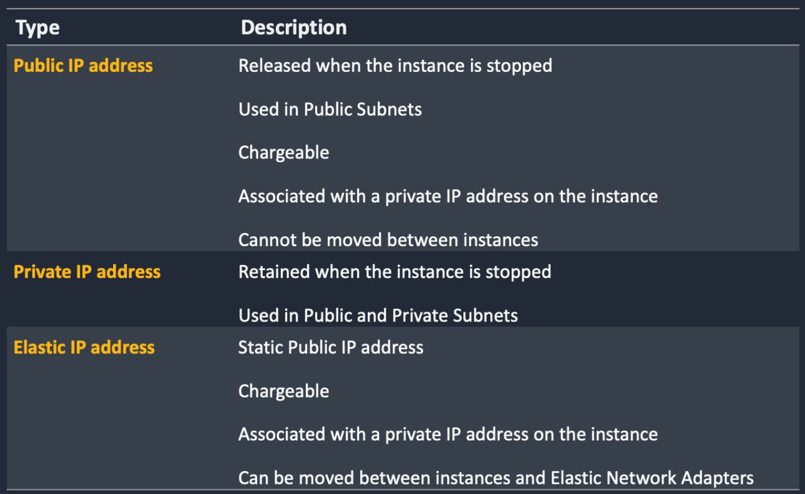
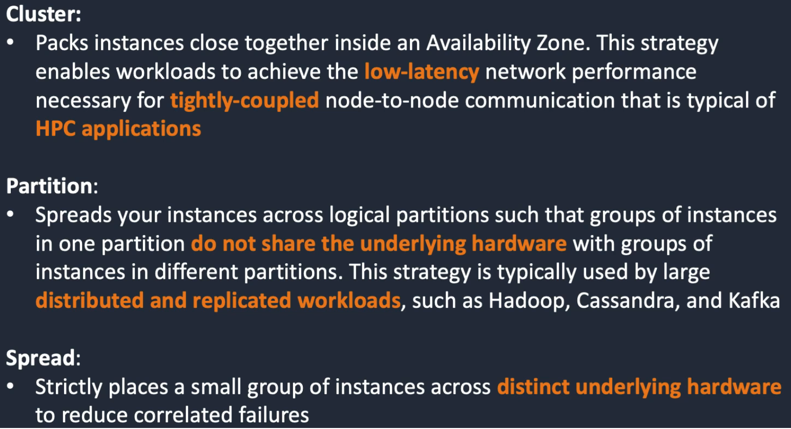
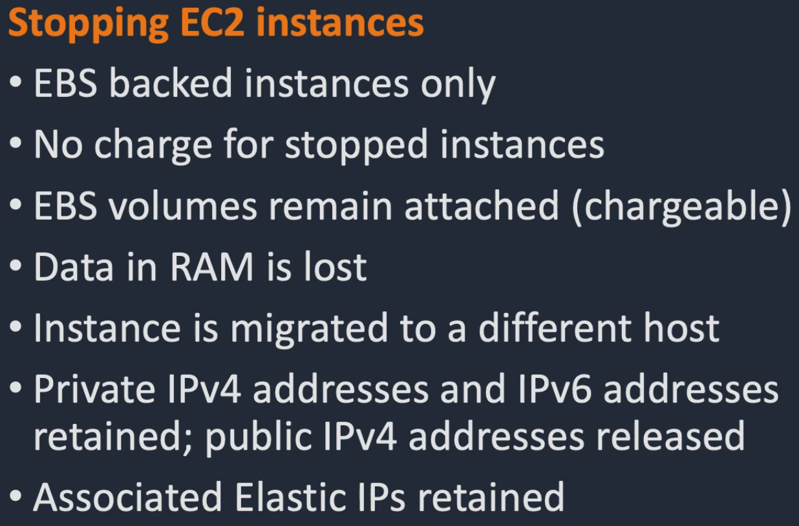
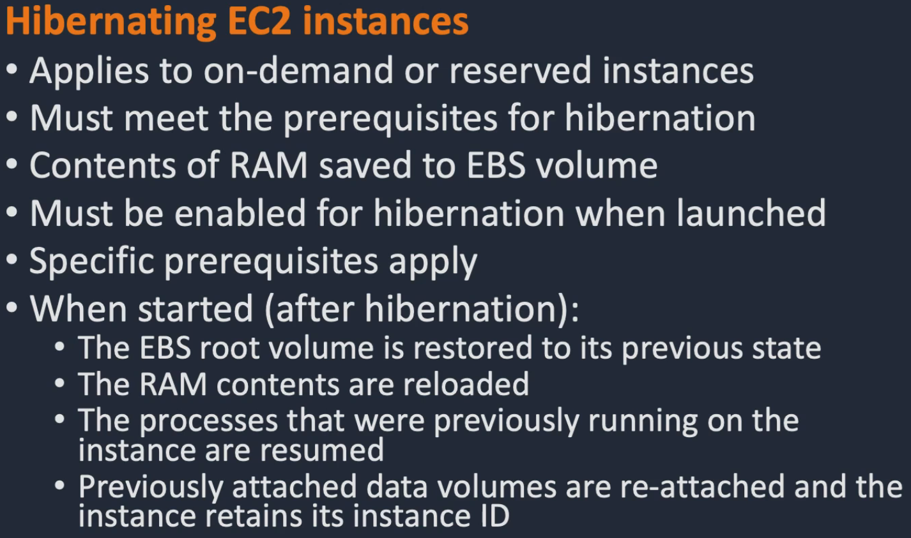
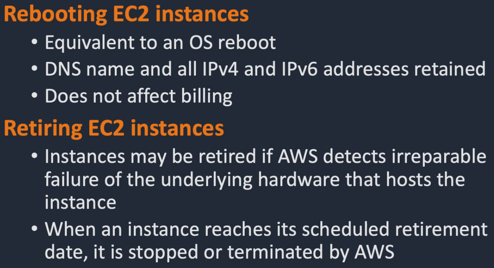
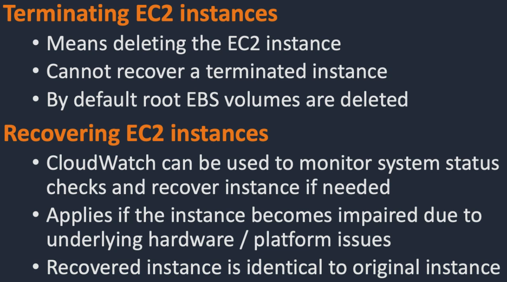
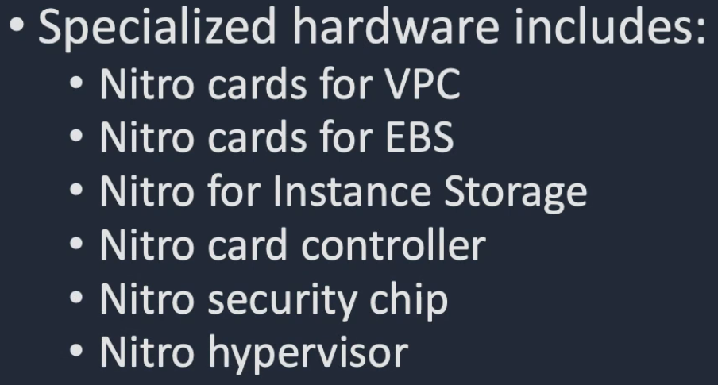

  	

		
			EC2 Instance
		
	

	
		- A virtual server deployed using AWS Infrastructure
	
	
		- Securely connect to instances via <strong>Key Pairs</strong>
	
	
		- Instance Storage is either <strong>EBS</strong> (persistent) or <strong>Instance Store</strong> (non-persistent)
	
	
		- <strong>AMI</strong> provides the information to launch an instance
	
	
		- <strong>User Data</strong> is a script that runs when an instance launches for the first time
	

  	

		
			EC2 Instance <strong>Pricing</strong> (6)
		
	

	

  	

		
			<strong>Dedicated Instances</strong> vs <strong>Dedicated Hosts</strong>
		
	

	

  	

		
			Benefits of EC2 (6)
		
	

	
		- <strong>Elasticity</strong> = Scale up or down instances quickly depending on your requirements
	
	
		- <strong>Control</strong> = Control instances with full root/admin access
	
	
		- <strong>Flexibility</strong> = Choose instance types, OS, software installed
	
	
		- <strong>Reliability</strong> = High availability, deployable in multiple AZ and Regions
	
	
		- <strong>Security</strong> = Deployable in VPC
	
	
		- <strong>Cost Effective</strong> = Pay for what you use
	

  	

		
			<strong>Public</strong>, <strong>Private</strong> and <strong>Elastic</strong> IP Addresses
		
	

	

  	

		
			<strong>Placement Groups</strong> (3)
		
	

	

  	

		
			<strong>NAT Gateway</strong>
		
	

	
		- Receive traffic from private subnet instance and forwards it to public internet via elastic ip address
	
	
		- AWS Managed
	
	
		- Must be deployed in a public subnet
	

  	

		
			EC2 Instance Lifecycle (6)
		
	

	
	 
	
	 
	
	 
	

  	

		
			<strong>Nitro System</strong>
		
	

	
		- Foundation of the latest generation of EC2 Instance. Better performance and security... close to bare metal performance
	
	
		- Breaks logical functions into specialized  hardware with a <strong>Nitro Hypervisor</strong>
	
	

## Architecture Patterns