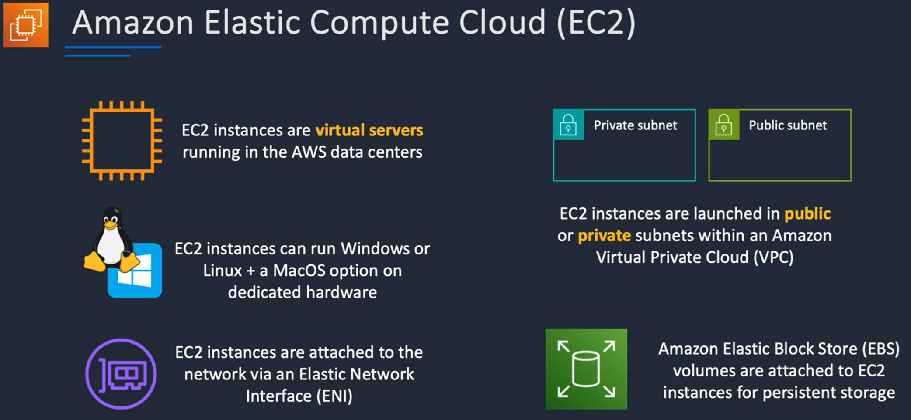
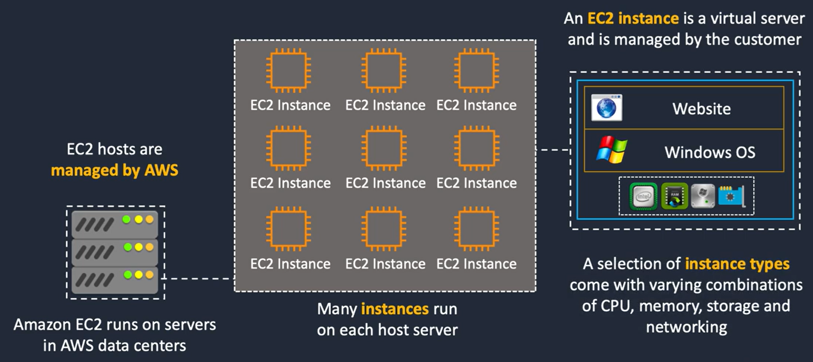
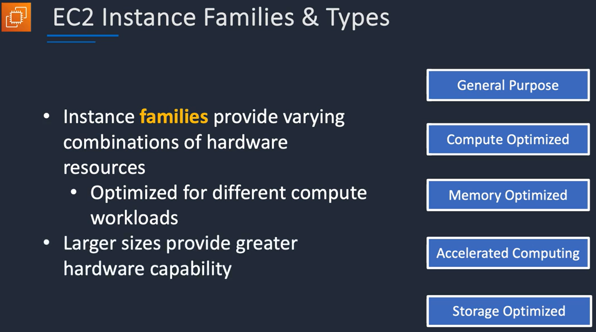
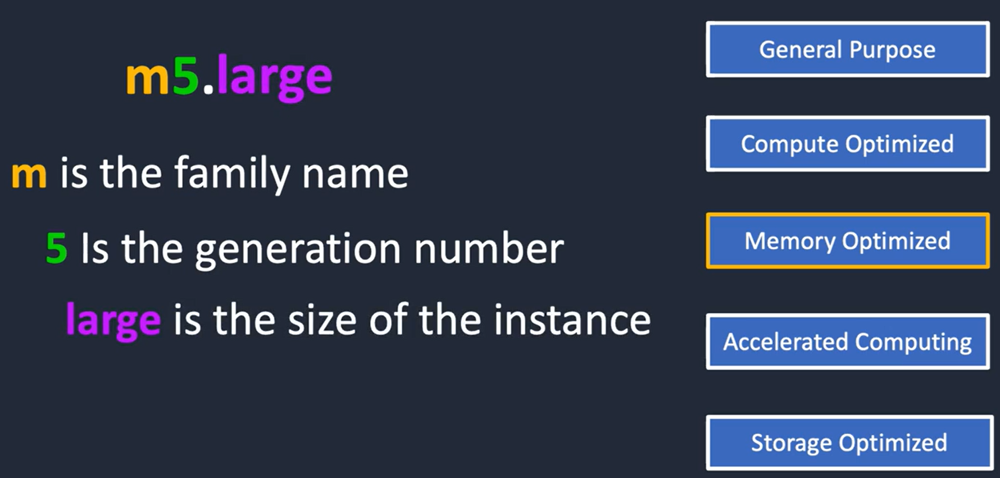
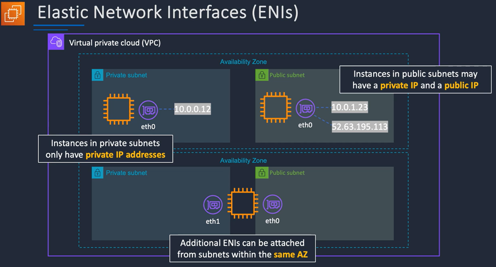
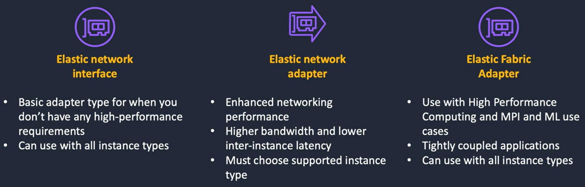
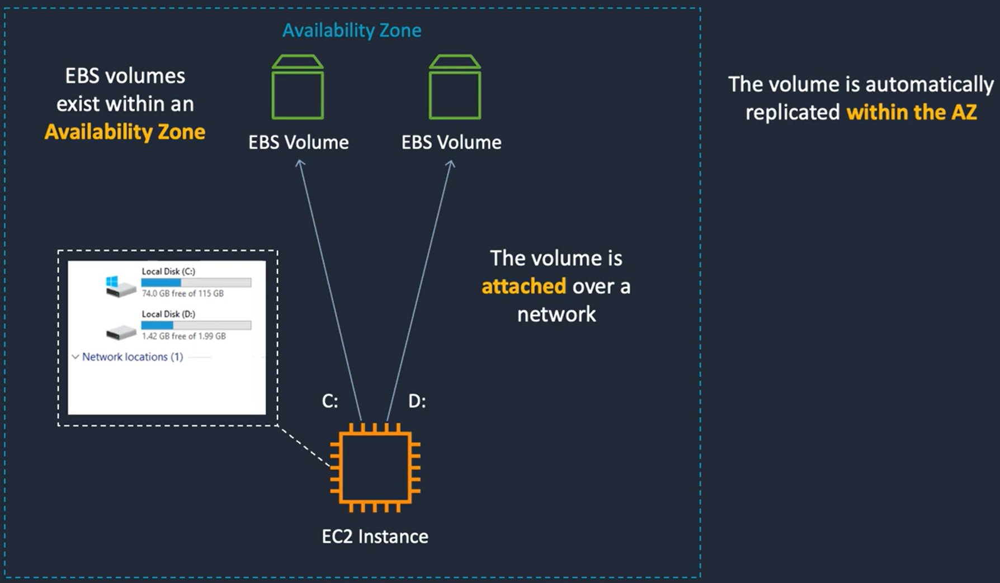
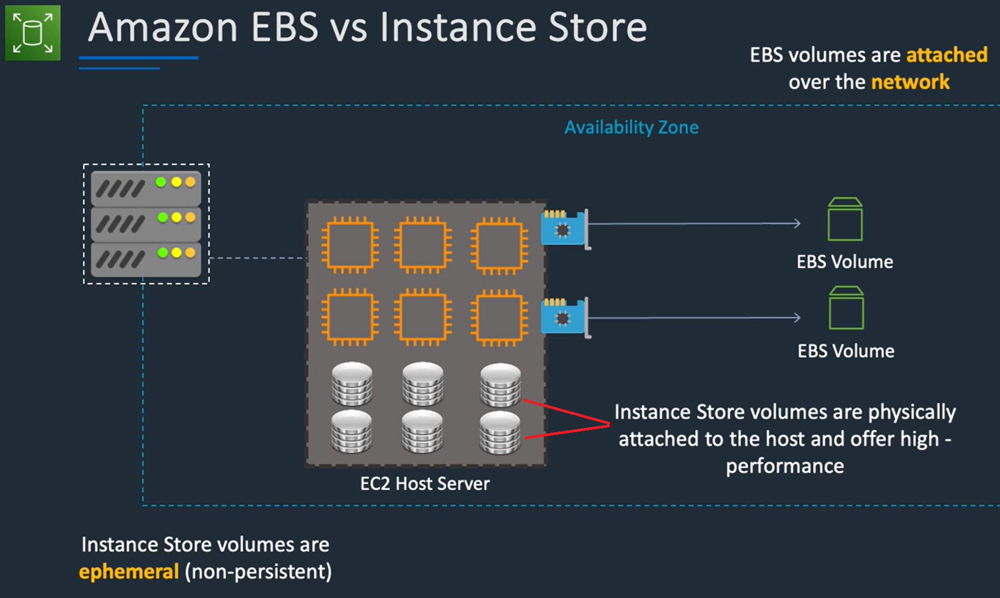

## EC2 Overview

- ### EC2 Instances are always deployed within a VPC

- ### Elastic Network Interfaces (ENI) are attached to EC2 Instances
	- ### They represent a virutal network card and hold IP Addresses

## Public, Private and Elastic IP Addresses

## Network Interfaces (ENI, ENA, EFA)
- ### Elastic Network Interface
- ### Elastic Network Adapter
- ### Elastic Fabric Adapter

## Elastic Block Store (EBS)
- ### EBS Volumes are attached to EC2 Instances forpersistent storage
- ### Different EBS Volume types for different requirements

## Instance Store
- ### Attached to the host server and not attached to EC2 Instances like EBS Volumes are
- ### Better performance than EBS Volumes, but not persistent storage (Ephemeral)
	- ### If EC2 Instance stops, data is lost
